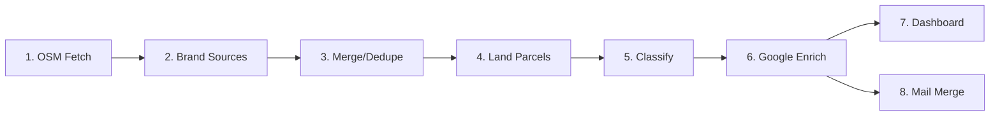

# Caravan Parks Development Pipeline v2.0
### Enhanced with Google Places Enrichment & Development Scoring

## 🚀 What's New in v2.0

- **Google Places Integration**: Enriches contact details, ratings, reviews
- **Development Scoring**: 0-100 score for acquisition potential  
- **Chain Detection**: Automatically identifies BIG4, NRMA, Discovery parks
- **Victoria Support**: Handles VIC parks despite missing land data
- **Interactive Dashboard**: Streamlit app for exploring opportunities
- **Mail Merge System**: Automated outreach document generation

## Pipeline Architecture



## Quick Start

### Prerequisites
```bash
python -m venv .venv
source .venv/bin/activate  # Windows: .venv\Scripts\activate
pip install -r requirements.txt
```

### Get Google API Key
1. Go to https://console.cloud.google.com/
2. Create project, enable Places API (New) and Geocoding API
3. Create API key and add to `.env`:
```
GOOGLE_API_KEY=your_key_here
```

### Run Complete Pipeline

```bash
# Step 1-5: Original pipeline (OSM + Cadastral)
python -m src.overpass_fetch --states NSW QLD VIC --out data/osm_seed.csv
python -m src.brands.run_all --out data/brands_seed.csv
python -m src.merge_dedupe data/osm_seed.csv data/brands_seed.csv --out data/parks_merged.csv
python -m src.area_nsw --in data/parks_merged.csv --out data/parks_merged_nsw.csv
python -m src.area_qld --in data/parks_merged_nsw.csv --out data/parks_merged_nsw_qld.csv
python -m src.classify --in data/parks_merged_nsw_qld.csv --out data/caravan_parks_master.csv

# Step 6: NEW - Google Enrichment
python -m src.enrich_google --in data/caravan_parks_master.csv --out data/parks_enriched_final.csv

# Step 7: Launch Dashboard
streamlit run src/dashboard.py

# Step 8: Generate Mail Merge
python -m src.mail_merge --in data/parks_enriched_final.csv
```

## Development Scoring Algorithm

Parks are scored 0-100 based on:

| Factor | Weight | Logic |
|--------|--------|-------|
| Size | 30% | >50ha (30pts), 20-50ha (20pts), 8-20ha (10pts) |
| Contact | 20% | Phone (10pts), Email/Website (10pts) |
| Reviews | 25% | <3.5 stars (25pts), 3.5-4 (15pts), 4-4.5 (5pts) |
| Status | 25% | Closed (25pts), Operational (10pts) |
| Chain | +15 | Bonus for portfolio potential |
| Victoria | +10 | Untapped market bonus |

## Data Schema (Final Output)

```python
{
    # Original fields
    'park_id': str,
    'name': str,
    'state': str,
    'latitude': float,
    'longitude': float,
    'land_area_sqm': float,
    'land_parcel_ids': str,
    
    # Google enriched
    'phone': str,
    'email': str,
    'website': str,
    'rating': float,
    'total_reviews': int,
    'business_status': str,
    'permanently_closed': bool,
    
    # Development analysis
    'is_chain': bool,
    'chain_name': str,
    'development_score': float,
    'size_category': str,
    'opportunity_level': str  # 'hot', 'good', 'moderate', 'low'
}
```

## API Costs

| Dataset | Parks | API Calls | Cost |
|---------|-------|-----------|------|
| NSW/QLD >8ha | 1,166 | 2,332 | $40 |
| VIC Holiday | 471 | 942 | $16 |
| **Total** | 1,637 | 3,274 | **$56** |

## Project Structure

```
Caravan_Scraper/
├── src/
│   ├── overpass_fetch.py      # OSM data fetcher
│   ├── brands/                 # Brand-specific scrapers
│   ├── merge_dedupe.py        # Deduplication logic
│   ├── area_nsw.py            # NSW parcel enrichment
│   ├── area_qld.py            # QLD parcel enrichment
│   ├── classify.py            # Category classification
│   ├── enrich_google.py       # NEW: Google Places enrichment
│   ├── dashboard.py           # NEW: Streamlit dashboard
│   └── mail_merge.py          # NEW: Outreach generator
├── data/
│   ├── osm_seed.csv
│   ├── brands_seed.csv
│   ├── parks_merged.csv
│   ├── caravan_parks_master.csv
│   └── parks_enriched_final.csv  # FINAL OUTPUT
├── templates/                  # Mail merge templates
├── outputs/                    # Generated documents
└── requirements.txt
```

## Using Claude Code for Development

Claude Code can help with:

### 1. Debugging pipeline issues
```bash
claude-code "The merge_dedupe step is creating duplicates for chain parks"
```

### 2. Adding new features
```bash
claude-code "Add a function to estimate park value based on location and size"
```

### 3. Optimizing performance
```bash
claude-code "The Google API calls are too slow, how can I parallelize them?"
```

### 4. Creating reports
```bash
claude-code "Generate a PDF report of top 50 development opportunities"
```

## Deployment Options

### Local Development
```bash
python run.py  # Interactive CLI
```

### Cloud Deployment (recommended)
```bash
# Deploy dashboard to Streamlit Cloud
git push origin main
# Connect repo at share.streamlit.io
```

### Docker Container
```dockerfile
FROM python:3.9
COPY . /app
WORKDIR /app
RUN pip install -r requirements.txt
CMD ["python", "run.py"]
```

## Contributing

1. Fork the repository
2. Create feature branch (`git checkout -b feature/AmazingFeature`)
3. Commit changes (`git commit -m 'Add AmazingFeature'`)
4. Push to branch (`git push origin feature/AmazingFeature`)
5. Open Pull Request

## License

Private repository - not for distribution

## Contact

For questions or collaboration: [your-email]
